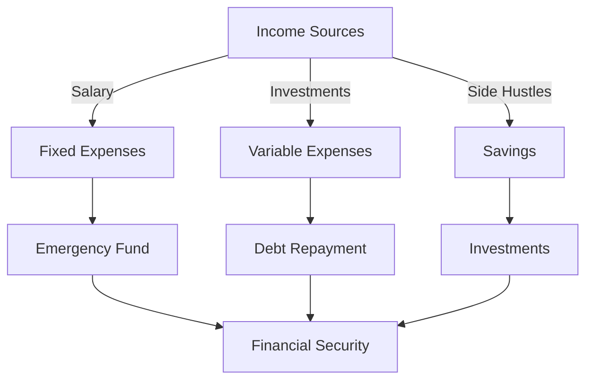

# Heading


---

## Subheading

1. Item 1
2. Item 2
3. Item 3

- Bullet list

    * Sublist


*This text Italic*

**This is bold**

[Link Here](https://www.google.com)

~~Crossed off~~

<mark> Highlight </mark>

X<sup>2</sup>

H<sub>2</sub>O

This is `let c=10`

```JS
Code Block
```


>Block qoute

line
-------
between

Table
|Col 1|Col 2|
|:-----:|:-----:|
|This |is   |
|A    |Table|
|that| is|
|bad|       |





